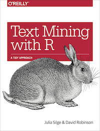

Welcome to the "Text Mining with R" FTI session. During this session, we will work through this R Notebook to do some text mining of Jane Austen's works, and turn our results into some charts. Our activities are taken directly from Chapter 1 of "[Text Mining with R: A Tidy Approach](https://www.tidytextmining.com/)" by Silge and Robinson. We're just going to scratch the surface on R and text mining, so if you're interested in pursuing this topic further, take a look at Silge & Robinson's free online text.

 

Within this R Notebook, we can automatically run code samples by clicking the green triangle button in samples like below (please note that messages beginning with "#" are comments):

```{r}
x<-3  #assigns "3" to variable "x"

x    #prints the value of x

```

Clicking the green triangle is fun and easy, but doesn't really help you learn R. So after most code samples, there will be an empty code block where you can write the code, and then can execute it by clicking the green triangle. In the sample below, create a variable called "y", set it equal to 45, and then print it.


```{r}
#enter your code below:


```


Before really getting going, keep in mind that you can create a web page output of this notebook by clicking the "Preview" button above. It makes this a little easier to read, and also makes this format great for things like tutorials, lab manuals, etc.

### Making our data "Tidy"

One of the big challenges of data science is to take "messy" data, and turn it into "cleaner" data that one can work with. In R, there is a package called the "tidyverse", which establishes some baselines for useful data and R functions to help convert data into "tidy" data. Some key "tidy" data principles are:

* Each variable is a column
* Each observation is a row
* Each type of observational unit is a table

Let's get started by working with a small data set. Below we're going to use the "c" function, to create an array of lines written by Jane Austen, and setting it equal to the variable *text*.

```{r}

text <- c("Because I could not stop for Death -",
          "He kindly stopped for me -",
          "The Carriage held but just Ourselves -",
          "and Immortality")

text

```


In the block below, set a variable called myText to an array of some sentences you create:

```{r}
# create and print the varibale myText and set it equal to an array of sentences


```


It's not uncommon to start out with an array of data. Our ultimate goal, though, is to "tidy" the data so it adheres to the tidy principles. We want to get our data into a format where each individual word is a value in a table (or "tibble") row. We're going to use the "dplyer" library (this is part of the "tidyverse") to start todying the data. 

```{r}
library(dplyr)
text_df <- tibble(line = 1:4, text = text)

text_df
```


Below, write similar code to convert your variable myText to a tibble (call the new variable myText_df).
```{r}

```

So we're getting there. We now have our data in a table, with each sentence in a tibble row. But our goal is to make each word its own unique row. So lets use the unnest_tokens function, which is part of the tidytext library:

```{r}
library(tidytext)

text_df %>%
  unnest_tokens(word, text)
```

Wait, what is that "%>%" symbol? It's the R "pipe" operator, and is used to pass data to functions, or chain functions together. It can be helpful to think of it as the word "then".


Now run the unnest_tokens function on your myText_df variable, and print it:
```{r}


```


Some key features of unnest_tokens:
*Other columns, such as the line number each word came from, are retained.
*Punctuation has been stripped.
*By default, unnest_tokens() converts the tokens to lowercase, which makes them easier to compare or combine with other datasets. (Use the to_lower = FALSE argument to turn off this behavior).

Now we have some tools to make our data "tidy". Let's do the same thing with a **MUCH** larger data set, and then we'll start running some analysis.


### Working with a larger data set


Now let's look at Jane Austen's six published novels. Fortuantely there's an R package that has this! Run the code below:

```{r}
library(janeaustenr)
library(dplyr)
library(stringr)
```


```{r}
original_books <- austen_books() %>%
  group_by(book) %>%
  mutate(linenumber = row_number(),
         chapter = cumsum(str_detect(text, regex("^chapter [\\divxlc]",
                                                 ignore_case = TRUE)))) %>%
  ungroup()

original_books
```

There is obviously a lot going on there, so let's try to break down what's going on:

* austen_books() is a pre-made tibble with two columns: text (each line of text) and book
* group_by(book) simply groups by the "book" field. This is key for the next step, where we want chapter info, and need to make sure the chapters are specific to each book.
* the mutate() function adds new variables (or table columns) while preserving existing ones. So to keep things simple, we're adding a "linenumber" column, and a "chapter" column. The linenumber column starts at 1 for each book (thanks to group_by(books)), and chapter uses regular expressions to find the text "chapter" to get the correct chapter number.
* ungroup() is called mainly because we're done making this updated tibble, so there's no longer a need to keep things grouped. All necessary groupings should be reflected in the tibble.


So now we're in a similar spot from the first exercise, where we have a line of text in each row, but we really want a single word in each row. So we can use the unnest_tokens() function again:

```{r}

# this requires "tidytext", so run library(tidytext) if you haven't already

tidy_books <- original_books %>%
  unnest_tokens(word, text)

tidy_books

```


Now it's your turn to replicate the code above. Create your new variable called myTidy_books:

```{r}

# this requires "tidytext", so run library(tidytext) if you haven't already


```


Now our tibble myText_books should be in the correct format of one word per row. 

Next we want to get rid of words we don't care about, like "a", "an", "the", etc. We can do this by loading the "stop words" data set, and then removing them (or "anti-joining" them) from our tibble:

```{r}
data(stop_words)

tidy_books <- tidy_books %>%
  anti_join(stop_words)
```


Now try the same with myTidy_books:

```{r}
data(stop_words)


```

Now that we've removed all the stop words, let's take a look at the frequency of word counts in our tidied tibble:

```{r}
tidy_books %>%
  count(word, sort = TRUE) 

```


Try doing the same with myTidy_books:

```{r}

```


Now let's create a visualization showing the most fruquently occurring words, using the ggplot library:

```{r}
library(ggplot2)

tidy_books %>%
  count(word, sort = TRUE) %>%
  filter(n > 600 ) %>%
  mutate(word = reorder(word, n)) %>%
  ggplot(aes(word, n)) +
  geom_col() +
  xlab(NULL) +
  coord_flip()
```


Now try the same with myTidy_books:

```{r}


```


